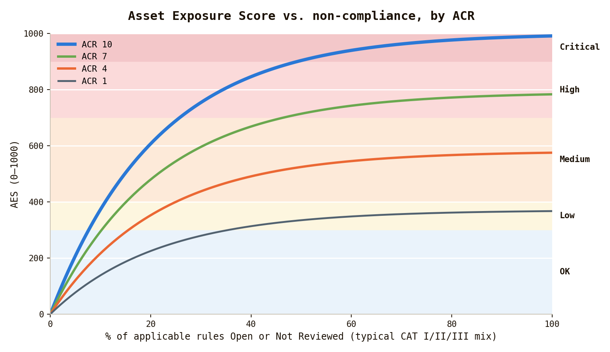
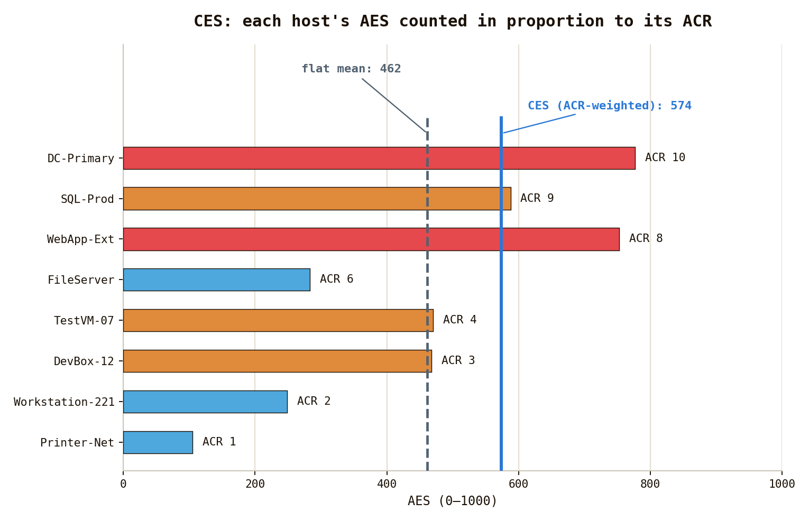

# STIG Dashboard

A single-file, offline dashboard for browsing and prioritizing DISA STIG checklist results — the same `.ckl` / `.cklb` output produced by **Evaluate-STIG**. Open [stig-dashboard.html](stig-dashboard.html) in a browser; everything runs client-side, nothing is uploaded anywhere.

If you've used **Nessus / ACAS**, this will feel familiar: Nessus weights raw CVSS severity by asset criticality to tell you what to fix first. This dashboard does the same for STIG findings — each finding's severity combines with an **Asset Criticality Rating (ACR)** for its host to produce a per-finding **criticality** and a per-asset **Asset Exposure Score (AES)**, so you can triage STIG results by risk instead of eyeballing raw severity counts. The Key Performance Indicator (KPI) is a single quantifiable value taken from the average of all organizational assets called the Composit Exposure Score (CES). If this value trends downward, you are doing great. If not, do better!

## Quick start

1. Open `stig-dashboard.html` in a browser.
2. Drag and drop `.ckl` / `.cklb` files onto the page, or click **Choose file(s)**. Drop multiple files at once — a file with multiple STIGs becomes one dashboard "asset" per STIG.
3. (Optional) Upload an ACR overrides CSV via **↑ ACR Overrides (CSV)** on the Assets view.
4. Browse via the left rail: **Dashboard**, **Assets**, **STIGs**, **Findings**, **Import**.

## Sample files

[`sample checklists/`](sample%20checklists) has example `.ckl` / `.cklb` files spanning common DoD device types — switches, routers, firewalls, ESXi/vCenter, domain controllers, SQL/PostgreSQL servers, workstations, a mail server, dev-shop services, mobile devices, and more — so you can demo the dashboard without real scan data.

[`tools/generate-sample-checklists.ps1`](tools/generate-sample-checklists.ps1) generated them, from a library of reusable STIG "profiles" (title + rule topics/severities) instantiated per host with randomized-but-varied finding statuses. Run `pwsh ./tools/generate-sample-checklists.ps1` to regenerate (overwrites existing samples); add a `New-Asset` call at the bottom to add more, reusing or defining a profile — see the script header for details.

## ACR overrides (`acr override.csv`)

Overrides the dashboard's auto-calculated ACR for specific hosts. **ACAS is the source of truth** — export assets and their ACR from ACAS, reshape to this format, and import here rather than hand-assigning:

```
hostname, acr
wks-04821, 8
```

`hostname` matches a loaded asset's host name (case-insensitive); `acr` is an integer 1–10 from ACAS. Upload via **↑ ACR Overrides (CSV)** after loading the referenced checklists — unmatched/invalid rows are reported back. Hosts not in the CSV fall back to the dashboard's auto-inferred ACR (from role/hostname/STIG signals) as a stand-in until a real ACAS value is imported.

ACR combines with each finding's severity to drive the **ACR × CAT criticality matrix** (CAT I/II/III + ACR band → Low/Medium/High/Critical) and the **AES** (0–1000 per asset, ACR combined with severity-weighted exposure of Open/Not Reviewed findings — the STIG equivalent of a Nessus risk score, used to rank assets).

## Scoring: AES and CES

### Asset Exposure Score (AES)

AES (0–1000, per asset) combines how much of an asset is non-compliant, weighted by finding severity, with that asset's ACR. Only Open and Not Reviewed findings count against it — Not a Finding and Not Applicable don't. `Not_Applicable` rules are also excluded from the denominator, so an asset's AES only reflects rules that actually apply to it, not how many rules its platform happened to N/A out.

1. **Density** — a severity-weighted average across every applicable rule:

   | Status | CAT I (high) | CAT II (medium) | CAT III (low) |
   |---|---|---|---|
   | Open | 15 | 5 | 2 |
   | Not Reviewed | 5 | 1.5 | 0.5 |

   ```
   density = (sum of severity weights for Open + Not Reviewed findings) / (applicable rules)
   ```

2. **Exposure score** — density runs through a saturating curve so a handful of bad findings moves the score quickly, while it tapers as it approaches 1000 instead of requiring near-total non-compliance to get there:

   ```
   exposureScore = 1000 × (1 − e^(−density / 1.2))
   ```

3. **AES** — exposure score scaled by the asset's ACR (1–10), so the same finding mix scores higher on a more critical asset:

   ```
   AES = min(1000, exposureScore × (0.3 + 0.07 × ACR))
   ```

Bands: **OK** < 300, **Low** 300–399, **Medium** 400–699, **High** 700–899, **Critical** ≥ 900.



### Composite Exposure Score (CES)

CES is the fleet-wide KPI — a single number meant to trend over time. It's the ACR-weighted average of every loaded asset's AES, not a flat average: a critical domain controller pulls the number more than a low-value printer at the same AES.

```
CES = Σ(AES × ACR) / Σ(ACR)   — across every loaded asset
```



In the fleet above, a flat average of the eight hosts' AES lands at 462. Weighting by ACR pulls it up to 574, because the two worst-scoring hosts (DC-Primary, WebApp-Ext) also carry the highest ACR — closer to the actual risk picture than treating a printer's exposure the same as a domain controller's.

## Other features

- **Findings** can be filtered/sorted and exported to CSV per view (**↓ export CSV**).
- **Import** lists every loaded file/asset and lets you remove or add more.
- Reloading the page clears all loaded data — nothing is persisted.
